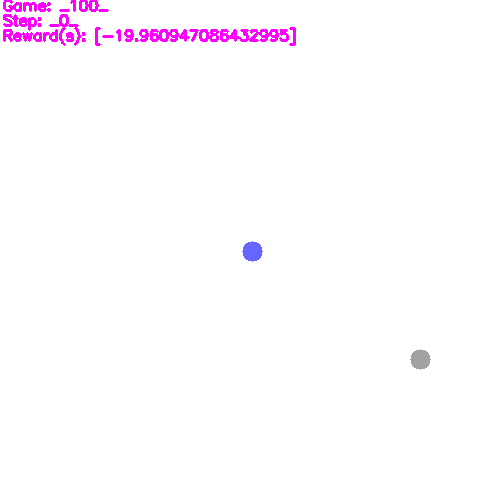
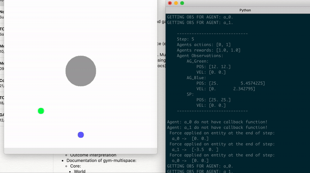

# Multi-Agent Gym Environment

Training environment for project: [gym-multispace-AI](https://github.com/matiktli/gym-multispace-ai).\
(BSc Software Engineer final project)

## About

Simple physical environment for training reinforecement learning agents. In format of [Gym](https://gym.openai.com/) from OpenAi. Supporting multiple agents.

## Instalation

Install environment with required packages: 
```
pip install -e .
```

Implement OpenAi gym
```python
import gym
import gym_multispace
gym.make('multispace-v0')
```

or create environment via util:
```python
from gym_multispace import env_util
env = env_util.create_env(scenario_path = '...')
```

## Documentation

Link to docs: [DOCS](https://github.com/matiktli/gym-multispace/blob/master/gym_multispace/README.md)

## Running sample game
```python
# Load scenario and create gym-ai environment
env = create_env(scenario_path='sample_scenario.py')
# Reset environment before first step
env.reset()
for i in range(100):
    # Chose random action for agent in current step
    move_act = env.action_space.sample()
    
    # Send action to environemnt via making a step,
    # returning observations, rewards and other for all agents.
    obs_n, rew_n, done_n, info_n = env.step(action_n=[move_act])

    # Render environment image on each step
    env.render(mode='human')
```

## Assets

Sample game where agent(blue) is learning to reach the goal(gray).\



Momentum example.\


## License

Free

---

Thanks to Hailite.io for inspiration: <https://2016.halite.io/index.html>.\
Thanks to OpenAi for sharing resources: <https://github.com/openai/multiagent-particle-envs>.
